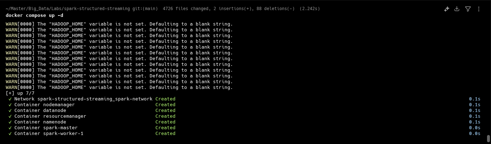
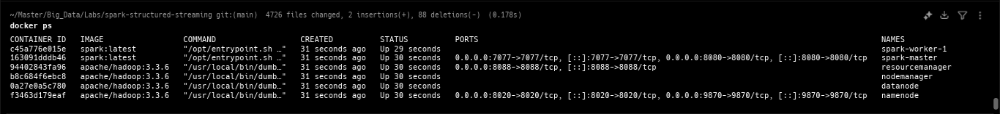
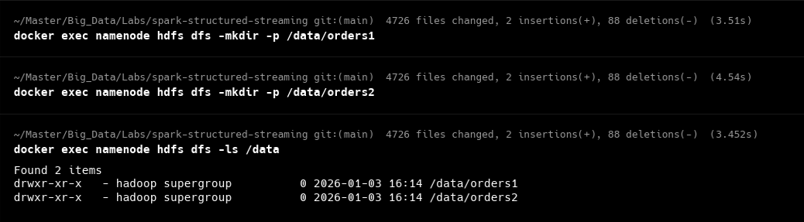
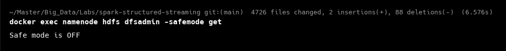

# Rapport Projet - Apache Spark Structured Streaming

##  Table des matières
1. [Vue d'ensemble du projet](#vue-densemble-du-projet)
2. [Architecture et technologies](#architecture-et-technologies)
3. [Structure du projet](#structure-du-projet)
4. [Prérequis](#prérequis)
5. [Guide d'installation](#guide-dinstallation)
6. [Exécution de l'application](#exécution-de-lapplication)
7. [Étapes de mise en place](#étapes-de-mise-en-place)
8. [Fonctionnalités](#fonctionnalités)
9. [Schémas de données supportés](#schémas-de-données-supportés)

---

##  Vue d'ensemble du projet

Ce projet implémente une **application de streaming structuré Apache Spark** qui traite et analyse des données de commandes en temps réel. L'application lit les fichiers CSV depuis HDFS et effectue diverses analyses de données telles que l'agrégation des ventes, le groupage par client, le groupage par produit, et le calcul de statistiques.

**Caractéristiques principales:**
-  Streaming structuré avec Apache Spark 3.5.1
-  Intégration avec HDFS pour le traitement des fichiers
-  Support de deux schémas de données différents
-  Déploiement containerisé avec Docker Compose
-  Logging configuré pour une meilleure visibilité

---

##  Architecture et technologies

### Technologies utilisées:
- **Apache Spark**: 3.5.1 (avec Scala 2.12)
- **Java**: 11
- **Maven**: Gestion des dépendances et build
- **HDFS**: Système de fichiers distribué
- **Docker & Docker Compose**: Containerisation et orchestration
- **Log4j2**: Logging et monitoring

### Composants de l'infrastructure:
```
┌─────────────────────────────────────────┐
│      Docker Compose Environment         │
├─────────────────────────────────────────┤
│ ✓ NameNode (HDFS Master)                │
│ ✓ DataNode (HDFS Slave)                 │
│ ✓ Spark Master                          │
│ ✓ Spark Worker                          │
│ ✓ Spark History Server                  │
└─────────────────────────────────────────┘
```

---

##  Structure du projet

```
spark-structured-streaming/
├── pom.xml                          # Configuration Maven
├── docker-compose.yaml              # Orchestration des services
├── README.md                        # Ce fichier
├── config/                          # Fichiers de configuration
├── data/                            # Données d'entrée
│   ├── orders1.csv                 # Format Schema V1
│   ├── orders2.csv                 # Format Schema V2
│   └── orders3.csv                 # Format Schema V2
├── src/
│   ├── main/
│   │   ├── java/ma/enset/
│   │   │   └── Main.java           # Classe principale
│   │   └── resources/
│   │       └── log4j2.properties   # Configuration du logging
│   └── test/
└── images/                          # Screenshots et diagrammes
```

---

##  Prérequis

Avant de commencer, assurez-vous d'avoir installé:

- **Docker**: [Installer Docker](https://docs.docker.com/get-docker/)
- **Docker Compose**: [Installer Docker Compose](https://docs.docker.com/compose/install/)
- **Maven**: [Installer Maven](https://maven.apache.org/install.html)
- **Java 11**: [Installer Java 11](https://www.oracle.com/java/technologies/javase/jdk11-archive-downloads.html)
- **Git**: (optionnel) pour cloner le repository

---

##  Guide d'installation

### Étape 1: Cloner le projet

```bash
git clone https://github.com/your-repo/spark-structured-streaming.git
cd spark-structured-streaming
```

### Étape 2: Construire le projet Maven

Exécutez la commande Maven pour compiler et packager l'application:

```bash
mvn clean package
```


**Résultat attendu**: Un fichier JAR `spark-structured-streaming-1.0-SNAPSHOT.jar` est généré dans le répertoire `target/`.


### Étape 3: Démarrer l'environnement Docker

Lancez les services Docker avec Docker Compose:

```bash
docker-compose up -d
```



### Étape 4: Vérifier les conteneurs

Vérifiez que tous les conteneurs sont en cours d'exécution:

```bash
docker ps
```



---

##  Exécution de l'application

### Étape 5: Créer les répertoires HDFS

Accédez au conteneur NameNode et créez les répertoires nécessaires:

```bash
docker exec namenode hdfs dfs -mkdir -p /data/orders1
docker exec namenode hdfs dfs -mkdir -p /data/orders2
```



### Étape 6: Désactiver le Safe Mode (si nécessaire)

```bash
docker exec namenode hdfs dfsadmin -safemode leave
```



### Étape 7: Copier les fichiers JAR et données vers Spark Master

Copiez le JAR généré vers le conteneur Spark Master:

```bash
docker cp target/spark-structured-streaming-1.0-SNAPSHOT.jar spark-master:/opt/spark-apps/
```


### Étape 8: Télécharger les fichiers de données dans HDFS

Copiez les fichiers de données dans les conteneurs et téléchargez-les dans HDFS:

```bash
docker cp data/orders1.csv namenode:/tmp/
docker exec namenode hdfs dfs -put /tmp/orders1.csv /data/orders1/
```


```bash
docker cp data/orders2.csv namenode:/tmp/
docker cp data/orders3.csv namenode:/tmp/
docker exec namenode hdfs dfs -put /tmp/orders2.csv /data/orders2/
docker exec namenode hdfs dfs -put /tmp/orders3.csv /data/orders2/
```


### Étape 9: Vérifier les fichiers dans le conteneur

```bash
docker exec namenode ls -la /tmp/
```


### Étape 10: Lancer l'application Spark Structured Streaming

#### Option 1: Avec Schema V1 (orders1.csv)

```bash
docker exec spark-master spark-submit \
  --class ma.enset.Main \
  /opt/spark-apps/spark-structured-streaming-1.0-SNAPSHOT.jar 1
```


#### Option 2: Avec Schema V2 (orders2.csv / orders3.csv)

```bash
docker exec spark-master spark-submit \
  --class ma.enset.Main \
  /opt/spark-apps/spark-structured-streaming-1.0-SNAPSHOT.jar 2
```


---

##  Étapes de mise en place (Résumé)

| # | Étape | Commande | Statut |
|---|-------|----------|--------|
| 1 | Build Maven | `mvn clean package` |  Génère le JAR |
| 2 | Docker Up | `docker-compose up -d` |  Démarre les services |
| 3 | Créer répertoires HDFS | `docker exec namenode hdfs dfs -mkdir -p /data/orders1` | ✅ Répertoires créés |
| 4 | Safe Mode | `docker exec namenode hdfs dfsadmin -safemode leave` |  Safe Mode désactivé |
| 5 | Copier JAR | `docker cp target/... spark-master:/opt/spark-apps/` |  JAR copié |
| 6 | Télécharger données | `docker exec namenode hdfs dfs -put ...` |  Données chargées |
| 7 | Lancer Spark | `docker exec spark-master spark-submit ...` |  Application lancée |

---

##  Fonctionnalités

L'application implémente les analyses de streaming suivantes:

### 1. **Affichage des commandes brutes (Raw Orders)**
- Affiche en temps réel chaque nouvelle commande reçue
- Mode de sortie: Append (ajout à la console)

### 2. **Agrégation des ventes (Total Sales)**
- Calcule le total cumulé de toutes les ventes
- Mode de sortie: Complete (affichage du résultat global)

### 3. **Groupage par client (Orders by Client)**
- Groupe les commandes par client
- Calcule le nombre de commandes et le montant total par client
- Mode de sortie: Complete

### 4. **Groupage par produit (Orders by Product)**
- Groupe les commandes par produit
- Calcule le total des ventes par produit
- Mode de sortie: Complete

### 5. **Statistiques détaillées (Statistics)**
- Calcule des statistiques sur les quantités et montants
- Inclut min, max, moyenne, somme
- Mode de sortie: Complete

---

##  Schémas de données supportés

### **Schema V1** (orders1.csv)

```
order_id | client_id | client_name | product | quantity | price | order_date | status | total
---------|-----------|-------------|---------|----------|-------|------------|--------|--------
1        | C001      | Fatima      | Laptop  | 1        | 800   | 2024-01-01 | Active | 800
2        | C002      | Ahmed       | Phone   | 2        | 300   | 2024-01-01 | Active | 600
...
```

**Colonnes:**
- `order_id`: Identifiant unique de la commande (Long)
- `client_id`: Identifiant du client (String)
- `client_name`: Nom du client (String)
- `product`: Nom du produit (String)
- `quantity`: Quantité commandée (Integer)
- `price`: Prix unitaire (Double)
- `order_date`: Date de la commande (String)
- `status`: Statut de la commande (String)
- `total`: Montant total (Double)

---

### **Schema V2** (orders2.csv, orders3.csv)

```
order_id | client_id | product_id | product_name | quantity | unit_price | total_amount | order_date | status
---------|-----------|------------|--------------|----------|------------|--------------|------------|--------
1        | C001      | P001       | Laptop       | 1        | 800        | 800          | 2024-01-02 | Active
2        | C002      | P002       | Phone        | 2        | 300        | 600          | 2024-01-02 | Active
...
```

**Colonnes:**
- `order_id`: Identifiant unique de la commande (Long)
- `client_id`: Identifiant du client (String)
- `product_id`: Identifiant du produit (String)
- `product_name`: Nom du produit (String)
- `quantity`: Quantité commandée (Integer)
- `unit_price`: Prix unitaire (Double)
- `total_amount`: Montant total (Double)
- `order_date`: Date de la commande (String)
- `status`: Statut de la commande (String)

---

##  Configuration avancée

### Log4j2 Configuration (log4j2.properties)

Le fichier `src/main/resources/log4j2.properties` configure les niveaux de logging:

```properties
# Réduire le bruit des logs Spark
org.apache.spark=WARN
org.apache.hadoop=WARN
akka=ERROR
org.eclipse.jetty=ERROR
```

### Paramètres Spark (optionnel)

Pour des configurations de performance, modifiez les paramètres dans `docker-compose.yaml`:

```yaml
environment:
  SPARK_DRIVER_MEMORY: "2g"
  SPARK_EXECUTOR_MEMORY: "2g"
  SPARK_EXECUTOR_CORES: "2"
```

---

##  Arrêter l'application

Pour arrêter et nettoyer l'environnement:

```bash
# Arrêter Docker Compose
docker-compose down

# Supprimer les volumes (données persistantes)
docker-compose down -v
```

---


